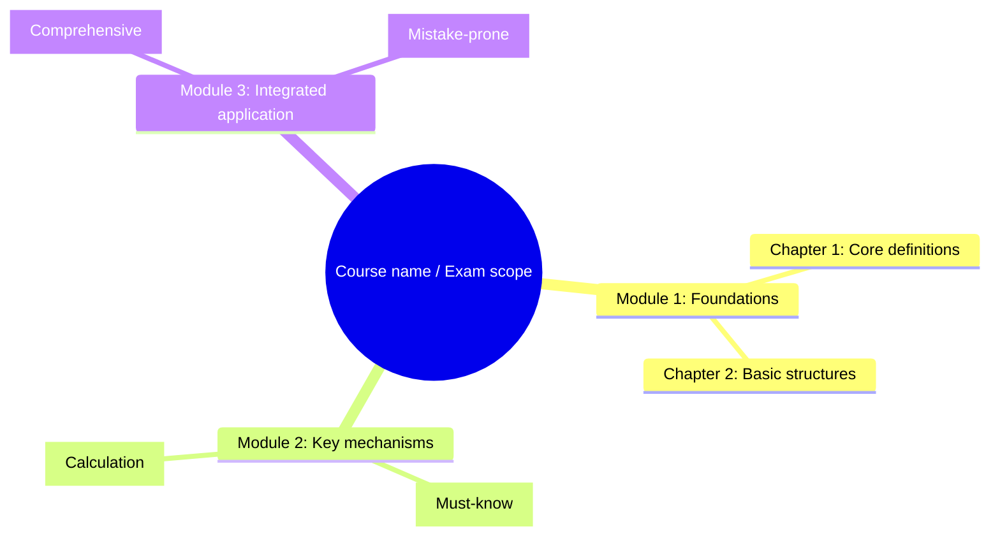
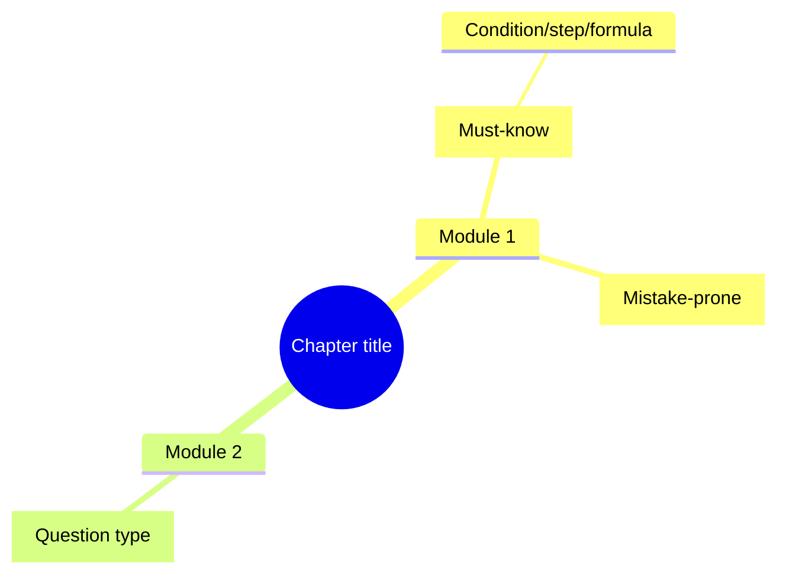

# Mind Map Generation Guide

This module generates course overview mind maps and chapter overview mind maps for university final-review materials. A mind map is not decoration; it is a study structure that reorganizes uploaded materials into chapter hierarchy, knowledge relationships, exam-point clues, and mistake-prone areas.

## Use cases

Use mind maps by default in:

- Course overview
- Every chapter overview
- Concept system summaries
- Complex processes, algorithms, experiments, cases, or theoretical frameworks
- Final sprint review and quick memorization
- Chapter guide pages in DOCX handouts

## Input evidence

Mind-map nodes must be extracted from the user's uploaded or explicitly mentioned materials. Prioritize:

1. PPT / lecture-note heading hierarchy
2. Textbook chapter and section headings
3. Diagrams, tables, flowcharts, and structural figures
4. Definitions, formulas, theorems, and algorithmic steps
5. Worked examples, assignments, and past papers
6. Experiment steps, case elements, and instructor-emphasized points
7. User-specified exam scope and priorities

Background knowledge that is not in the materials may be added only when necessary and must be labeled as `Supplementary background`. Do not place it in the main trunk as if it came from the uploaded materials.

## Course overview mind map

The course overview mind map shows the main logic of the whole course. Include:

- Course name or exam scope as the center node
- Chapter/module grouping
- Logical relationships between chapters
- High-frequency chapters, key chapters, and foundational chapters
- Concepts, formulas, methods, or analysis frameworks that run across the course
- Recommended final-sprint review order

Example structure:



## Chapter overview mind map

Every chapter overview must include a mind map. Include:

- Chapter title as the center node
- First-level and second-level headings from the materials
- Important definitions, formulas, processes, algorithms, diagrams, cases, or experiment steps
- Worked examples, assignments, or past-paper clues
- Must-know points, high-frequency points, mistake-prone points, and question-type tags

Recommended hierarchy:

1. Center node: chapter title
2. First-level nodes: major modules
3. Second-level nodes: key concepts
4. Third-level nodes: conditions, steps, formula variables, diagram meanings, and question-type clues
5. Markers: `[Must-know]`, `[High-frequency]`, `[Mistake-prone]`, `[Calculation]`, `[Short answer]`, `[Comprehensive]`

## Node-writing rules

1. Keep nodes short, but not empty. Avoid vague nodes such as "concept", "principle", or "application" alone.
2. Express relationships from the materials, such as "classified into", "steps", "conditions", "affects", "depends on", "input/output", or "applies to".
3. For formula nodes, include the formula name, variable meaning, or applicable condition.
4. For process nodes, preserve the key step order.
5. For algorithm nodes, include input, core steps, output, complexity, or mistake-prone conditions.
6. For diagram/table nodes, describe the relationship or comparison dimensions shown by the figure/table.
7. For question-type nodes, name the task clearly, such as "drawing question: draw the state-transition diagram".

## Output formats

### Markdown default

Prefer Mermaid:



If Mermaid is not suitable, use an indented tree:

```text
Chapter title
├─ Module 1
│  ├─ Concept A [Must-know]
│  │  └─ Condition/step/formula
│  └─ Concept B [Mistake-prone]
└─ Module 2
   └─ Worked-example prototype [Question type]
```

### DOCX format

Mind maps in DOCX should prioritize print readability:

- Use hierarchy headings plus an indented tree
- Or use rounded boxes, table blocks, or process blocks
- Do not use fonts that are too small
- For large chapters, split the map into a main map plus submaps
- Highlight must-know, mistake-prone, and calculation nodes clearly

### Image format

Generate an image only when the user explicitly asks for a mind-map image. Build the image from a structured outline or Mermaid source first so the source structure is not lost.

## Reading guide

After each mind map, include a short reading guide explaining:

- Which main trunks to review first
- Which branches are must-know or high-frequency
- Which nodes require memorization
- Which nodes correspond to calculation, drawing, case, short-answer, or comprehensive questions
- Which nodes are easiest to confuse

## Quality checklist

Before outputting a mind map, check:

- [ ] It is grounded in uploaded or user-mentioned materials.
- [ ] It covers major chapters, sections, and knowledge blocks.
- [ ] It preserves formulas, processes, algorithms, diagrams, worked examples, and assignment clues from the materials.
- [ ] It expresses classification, process, causality, comparison, input-output, or sequential relationships.
- [ ] It marks must-know, high-frequency, mistake-prone, and question-type nodes.
- [ ] It avoids generic templates and decorative nodes.
- [ ] It includes a reading guide.