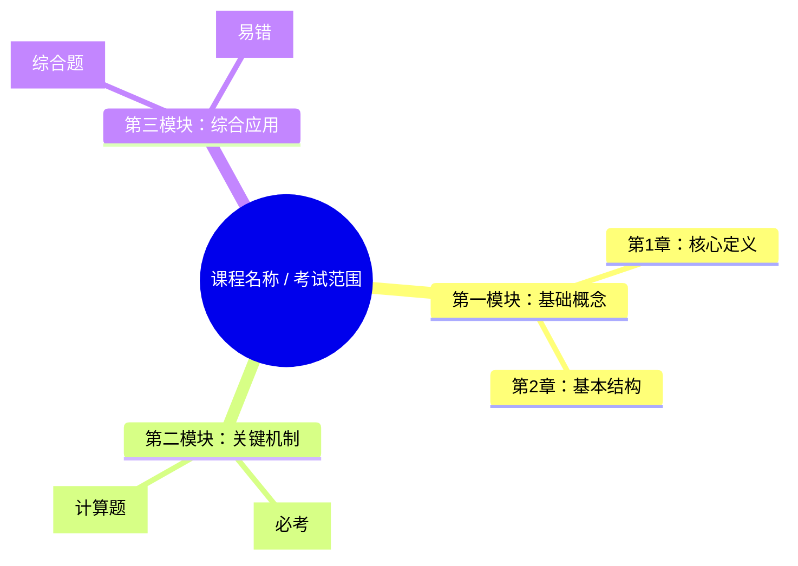
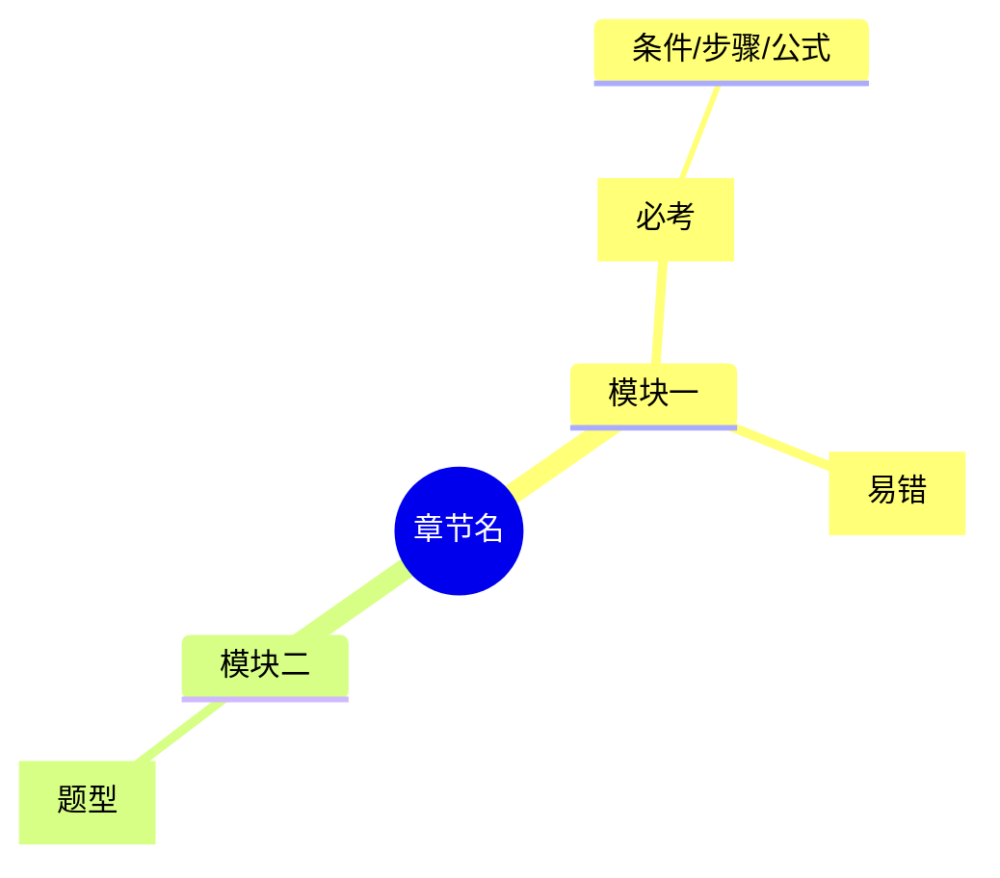

# 思维导图生成规范

本模块用于生成大学期末复习资料中的课程总览思维导图和章节总览思维导图。思维导图不是装饰图，而是把上传资料中的章节结构、知识关系、考点线索和易错点整理成可复习的结构图。

## 使用场景

在以下输出中默认使用思维导图：

- 课程总体框架
- 每章章节总览
- 概念体系梳理
- 复杂流程、算法、实验、案例或理论框架总结
- 考前速记和冲刺复习
- DOCX 讲义中的章节导读页

## 输入依据

思维导图必须从用户上传或明确提到的资料中抽取节点，优先使用：

1. PPT / 讲义标题层级
2. 教材章节和小节标题
3. 图、表、流程图、结构图
4. 定义、公式、定理、算法步骤
5. 例题、作业题、往年题
6. 实验步骤、案例要素、课堂强调点
7. 用户指定的考试范围和重点

资料中没有的背景知识可以补充，但必须标注为 `补充背景知识`，不能放进思维导图主干冒充上传资料。

## 课程总览思维导图

课程总览思维导图用于展示整门课的知识主线。应包含：

- 课程名称或考试范围作为中心节点
- 章节模块划分
- 各章节之间的逻辑关系
- 高频章节、重点章节和基础章节
- 贯穿全课的核心概念、公式、方法或分析框架
- 适合考前冲刺的复习顺序

示例结构：



## 章节总览思维导图

每章讲义的章节总览必须包含思维导图。应包含：

- 章节标题作为中心节点
- 资料中的一级标题和二级标题
- 重要定义、公式、流程、算法、结构图、案例或实验步骤
- 典型例题、作业题或往年题线索
- 必考点、高频考点、易错点和题型标签

推荐节点层级：

1. 中心节点：章节名
2. 一级节点：本章主要模块
3. 二级节点：关键知识点
4. 三级节点：条件、步骤、公式变量、图表含义、题型线索
5. 标记：`[必考]`、`[高频]`、`[易错]`、`[计算题]`、`[简答题]`、`[综合题]`

## 节点编写规则

1. 节点要短，但不能空。避免只写“概念”“原理”“应用”这类空节点。
2. 节点要体现资料关系，例如“分为”“步骤”“条件”“影响”“依赖”“输入/输出”“适用于”。
3. 对公式节点，写出公式名、变量含义或适用条件。
4. 对流程节点，按顺序写关键步骤。
5. 对算法节点，写输入、核心步骤、输出、复杂度或易错条件。
6. 对图表节点，写图表表达的关系或对比维度。
7. 对题型节点，写清楚题型和答题任务，例如“画图题：画状态转换图”。

## 输出格式

### Markdown 默认格式

优先使用 Mermaid：



如果 Mermaid 不适合当前环境，使用缩进树：

```text
章节名
├─ 模块一
│  ├─ 知识点A [必考]
│  │  └─ 条件/步骤/公式
│  └─ 知识点B [易错]
└─ 模块二
   └─ 例题原型 [题型]
```

### DOCX 格式

DOCX 中的思维导图应优先考虑打印可读性：

- 使用层级标题 + 缩进树
- 或使用圆角框、表格块、流程块表达层级
- 字号不要过小，避免一页塞入过多节点
- 大章节可以拆成“总图 + 子图”
- 必考、易错、计算题节点可使用醒目标记

### 图片格式

只有当用户明确要求“生成图片/思维导图图片”时才生成图片。图片生成前应先得到结构化大纲或 Mermaid 源码，保证图片内容不丢失资料结构。

## 读图说明

思维导图后必须附一段简短读图说明，说明：

- 先看哪几个主干
- 哪些分支是必考或高频
- 哪些节点需要背诵
- 哪些节点对应计算、画图、案例、简答或综合题
- 哪些节点最容易混淆

## 质量检查清单

输出思维导图前检查：

- [ ] 是否来自上传资料或用户明确提到的资料。
- [ ] 是否覆盖主要章节、小节和知识块。
- [ ] 是否保留资料中的公式、流程、算法、图表、例题和作业题线索。
- [ ] 是否体现了分类、流程、因果、对比、输入输出或先后关系。
- [ ] 是否标注了必考、高频、易错和题型。
- [ ] 是否避免了泛泛模板和装饰性节点。
- [ ] 是否配有读图说明。